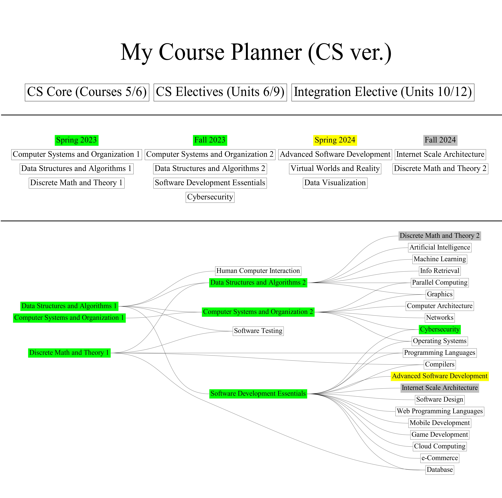

## Course DAG Visualizer
I started this project for a data visualization class assignment. The goal was to reimagine/invent a way of visualizing a course degree progress. The visual focuses on the perspective of the student and how they would interact with a dashboard to ***1. look at their current degree progress***, ***2. know what courses to take next***, and ***3. find customized course plans for a career.*** Currently uses '**graphviz**' and '**networkx**' to generate + compile into an output using '**PyPDF**'.

## Installation

### Prerequisites

- Python
- Jupyter Notebook

### Set-Up
```
git clone https://github.com/You-Gao/Course-DAG-Visualizer.git
pip install -r requirements.txt
```

## Usage (WIP)
Run the notebook to generate an output.pdf
To modify change the file variable

### Example


## License
This project is licensed under the [Creative Commons CC0 1.0 Universal License](https://creativecommons.org/publicdomain/zero/1.0/). See the [LICENSE](LICENSE) file for more details.
